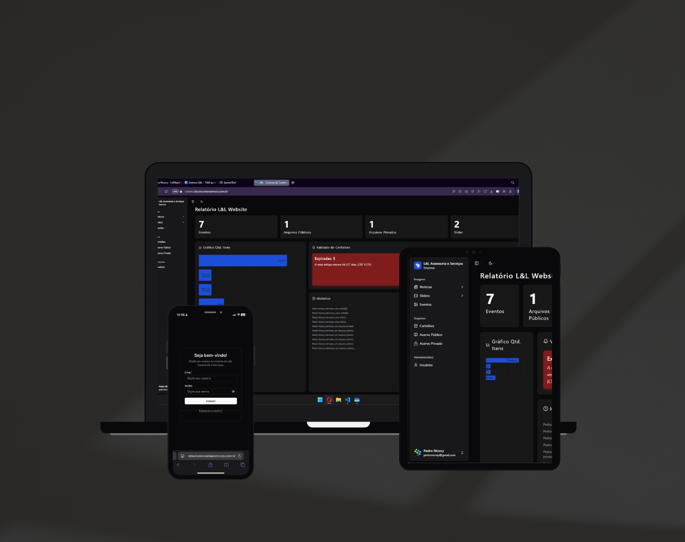

# 📂 CMS - L&L Assessoria e Serviços

> This is a **demonstration repository** for the custom CMS developed for L&L Assessoria e Serviços.

This platform was designed to simplify the internal and external content management process for the company, featuring a robust dashboard, user roles, file control, and certificate tracking.

---

## 🧰 Tech Stack

- [Next.js](https://nextjs.org/) — React framework with SSR and app routing  
- [Supabase](https://supabase.com/) — Auth, Storage & PostgreSQL Database  
- [ShadCN UI](https://ui.shadcn.com/) — Accessible and customizable UI components  
- [Recharts](https://recharts.org/en-US/) — Charting library for data visualization  
- [Tailwind CSS](https://tailwindcss.com/) — Utility-first CSS framework  

---

## ✨ Key Features

- 🔐 Secure authentication with Supabase Auth  
- 🗂️ File storage and media upload using Supabase Storage  
- 📑 Management of:
  - News and homepage sliders
  - Public and private documents
  - Company events
  - Certificates with expiration control and alerts  
- 📊 Interactive charts powered by Recharts  
- 🧩 Fully responsive UI with ShadCN components and Tailwind CSS  
- 📜 Audit log with timestamped user actions  

---

## 🖼️ Preview

  

---

## 🔗 Live Demo

👉 [llassessoriaeservicos.com.br](https://llassessoriaeservicos.com.br)

---

> ⚠️ This repository is for **demonstration purposes only**. No source code is available.
